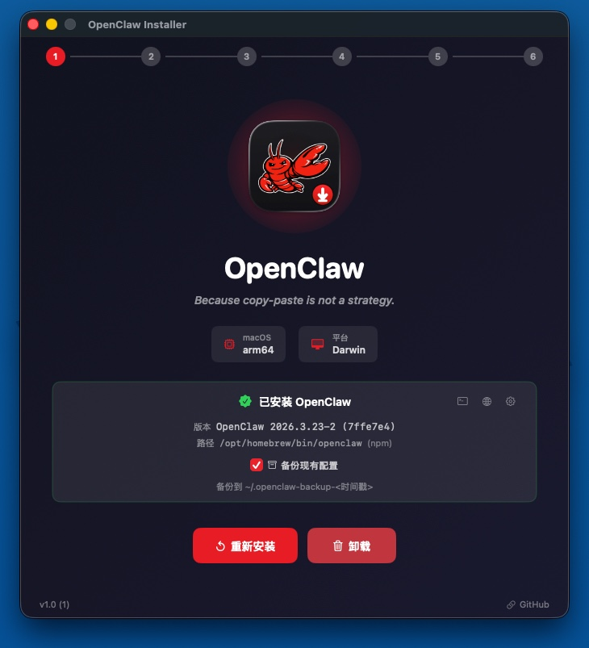
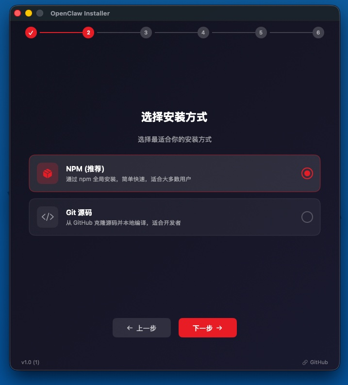
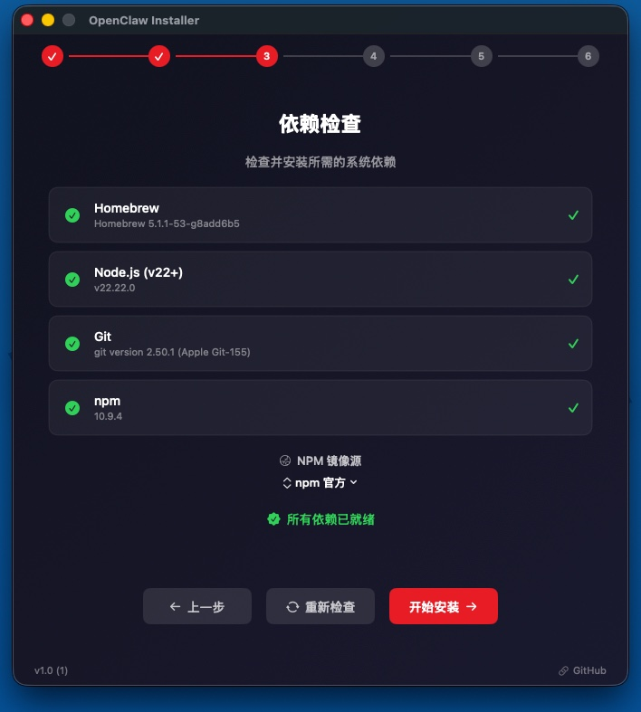
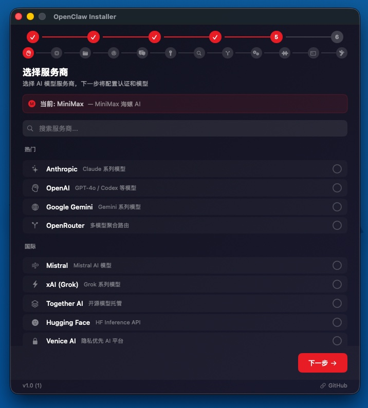
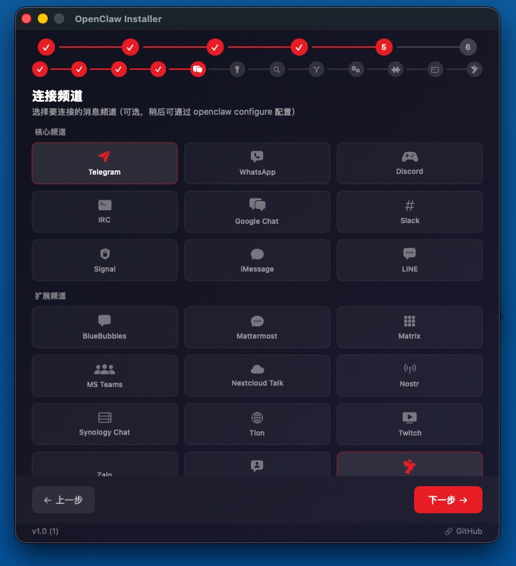
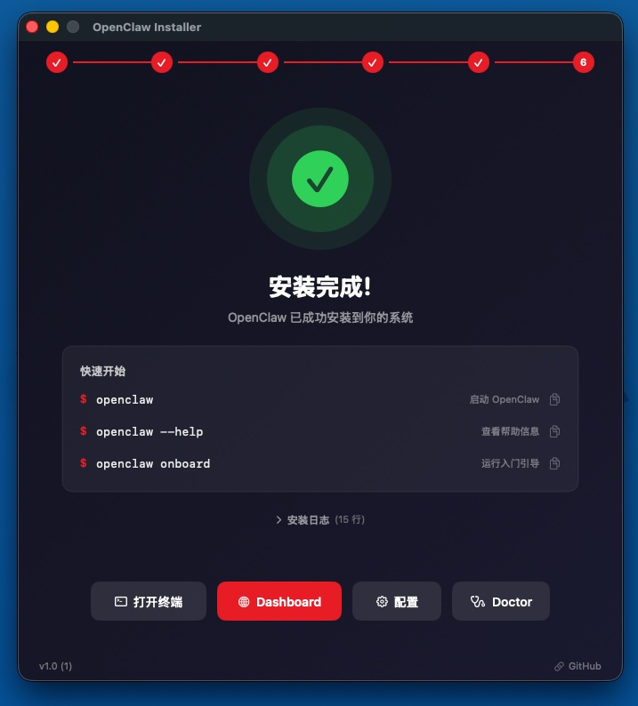
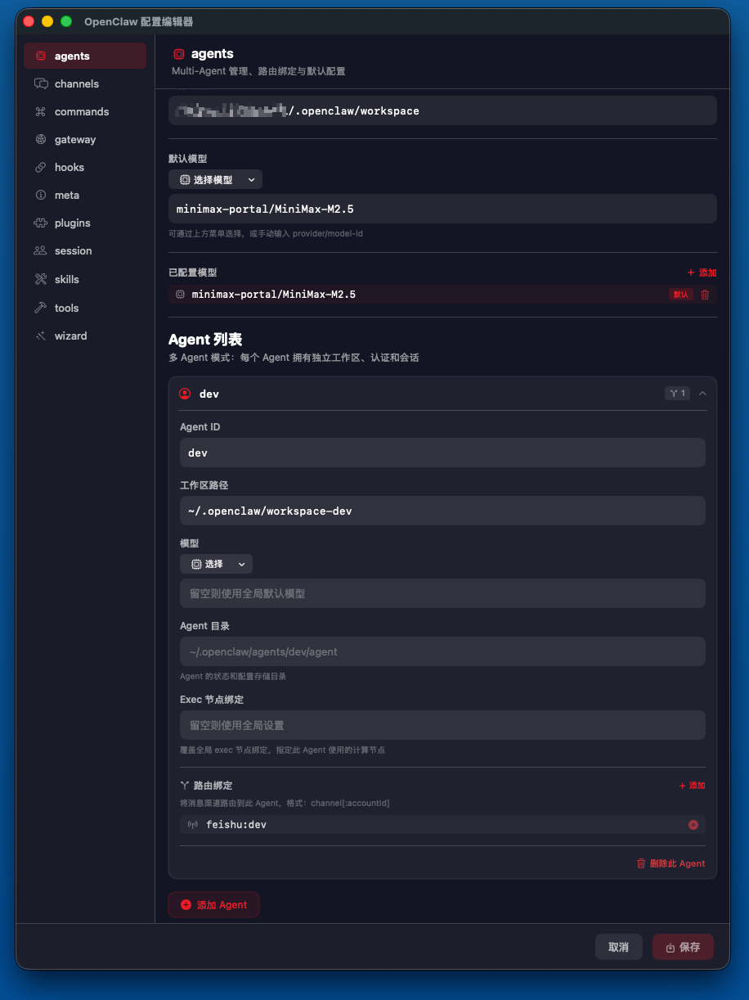
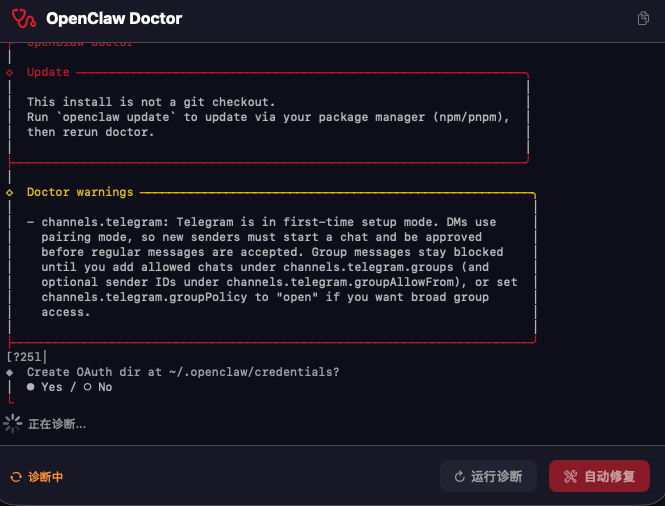

<div align="center">


# OpenClaw Installer

**A native macOS installer for [OpenClaw](https://github.com/nicepkg/openclaw) — built with SwiftUI**

*Because copy-paste is not a strategy.*

<!-- BADGES:START -->
<!-- generated by add-badges 2026-03-25 -->
[](https://swift.org)
[](https://developer.apple.com/macos/)
[](https://developer.apple.com/xcode/swiftui/)
[](LICENSE)
[](https://github.com/loverbabyz/OpenClawInstaller/releases)
<!-- BADGES:END -->

</div>

---

## Screenshots

<table>
  <tr>
    <td align="center"><br/><b>Welcome</b><br/><sub>System detection & version info</sub></td>
    <td align="center"><br/><b>Install Method</b><br/><sub>NPM or Git source</sub></td>
    <td align="center"><br/><b>Dependencies</b><br/><sub>Auto-check & install</sub></td>
  </tr>
  <tr>
    <td align="center"><br/><b>LLM Providers</b><br/><sub>40+ providers supported</sub></td>
    <td align="center"><br/><b>Channels</b><br/><sub>22 messaging channels</sub></td>
    <td align="center"><br/><b>Completion</b><br/><sub>Quick start commands</sub></td>
  </tr>
  <tr>
    <td align="center"><br/><b>Config Editor</b><br/><sub>GUI configuration</sub></td>
    <td align="center"><br/><b>Doctor</b><br/><sub>Diagnostics & auto-fix</sub></td>
    <td></td>
  </tr>
</table>

## Features

| Feature | Description |
|---------|-------------|
| **Guided Wizard** | 6-step installation flow: Welcome → Method → Dependencies → Install → Configure → Complete |
| **Multiple Install Methods** | npm (recommended) or git source — choose what fits your workflow |
| **Dependency Management** | Auto-detect & install Homebrew, Node.js v22+, Git, pnpm |
| **40+ LLM Providers** | Anthropic, OpenAI, Gemini, Mistral, xAI, domestic providers & more |
| **22 Channels** | Telegram, WhatsApp, Discord, Slack, WeChat, LINE, and many more |
| **Configuration Wizard** | Auth, models, gateway, hooks, skills — all in one flow |
| **Config Editor** | Standalone GUI to edit `~/.openclaw/openclaw.json` |
| **Doctor Diagnostics** | One-click health check with auto-fix |
| **Uninstall & Backup** | Clean removal with optional timestamped backup |

## Quick Start

### Download

Grab the latest `.dmg` from [**Releases**](https://github.com/loverbabyz/OpenClawInstaller/releases), open it, and drag to Applications.

### Build from Source

```bash
# Clone
git clone https://github.com/loverbabyz/OpenClawInstaller.git
cd OpenClawInstaller

# Open in Xcode
open OpenClawInstaller.xcodeproj

# Or build from command line
xcodebuild -project OpenClawInstaller.xcodeproj \
  -scheme OpenClawInstaller \
  -configuration Release
```

## Requirements

| Requirement | Version |
|-------------|---------|
| macOS | 13.0+ |
| Xcode | 15.0+ (for building) |

## Project Structure

```
OpenClawInstaller/
├── OpenClawInstallerApp.swift       # App entry point
├── ContentView.swift                # Main view with step navigation
├── ViewModels/
│   └── InstallerViewModel.swift     # Core business logic
├── Views/
│   ├── WelcomeView.swift            # System detection & uninstall
│   ├── MethodSelectionView.swift    # npm vs git selection
│   ├── DependencyCheckView.swift    # Prerequisite checks
│   ├── InstallProgressView.swift    # Installation progress
│   ├── OnboardingView.swift         # 12-step config wizard
│   ├── ConfigEditorView.swift       # Standalone config GUI
│   ├── ConfigSectionEditors.swift   # Config section components
│   ├── CompletionView.swift         # Final step & launch
│   └── DoctorView.swift             # Diagnostics view
└── Helpers/
    └── ShellExecutor.swift          # Shell command execution with PATH management
```

## License

[MIT](LICENSE)

---

<div align="center">

Made with SwiftUI for macOS

</div>
